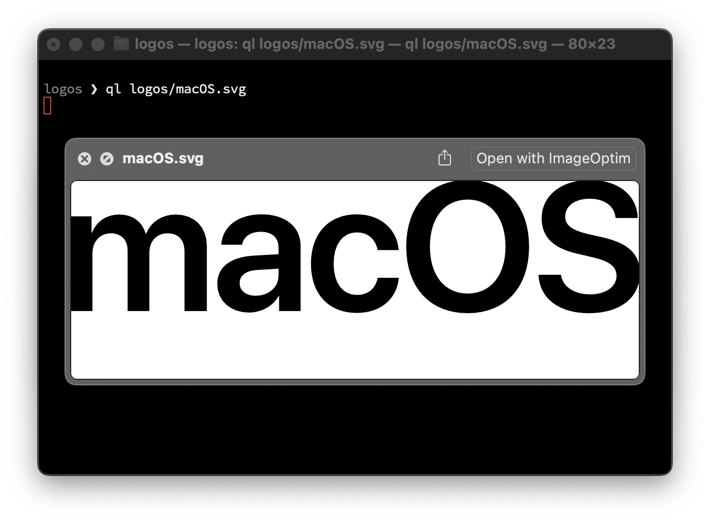
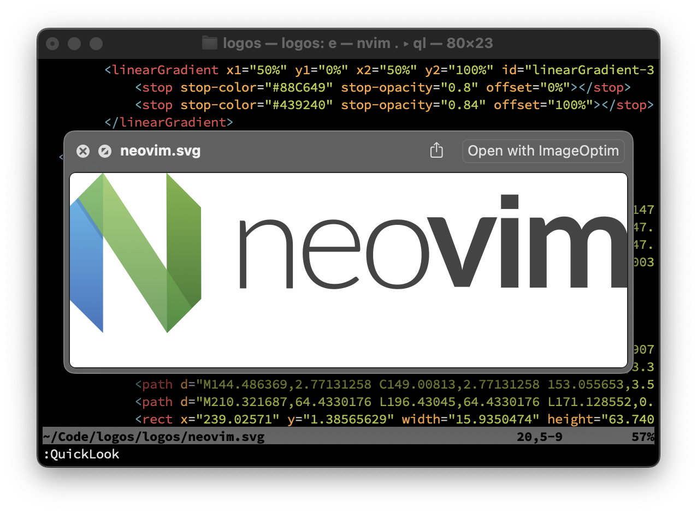

# ql

[](https://github.com/pmeinhardt/ql/actions/workflows/checks.yml)

| Allows you to preview files from the command-line | Integrates with Vim/Neovim         |
| ------------------------------------------------- | ---------------------------------- |
|                  |  |

Preview files from the command-line using macOS Quick Look.

Open a file in Quick Look from the command-line:

```shell
ql <path/to/file>
```

Yes, there is `qlmanage`. But you’d always have `[DEBUG]` staring at you.

## Installing 📦

You can install `ql` via Homebrew:

```shell
brew install --HEAD pmeinhardt/tools/ql
```

This will build the tool from source.

To update, use:

```shell
brew upgrade --fetch-HEAD pmeinhardt/tools/ql
```

## Building 🪛

In order to build the `ql` command, run:

```shell
swift build --configuration release
```

This requires macOS 12.0+ with `swift` installed.

You can copy the resulting binary anywhere you like or add the `.build/release` directory to your `PATH`.

## Vim plugin 🔩

There is a Vim plugin for `ql`. If you use [vim-plug](https://github.com/junegunn/vim-plug), add this line to your Vim configuration file:

```vim
Plug 'pmeinhardt/ql', {'do': ':QuickLookCompile'}
```

The plugin provides a `:QuickLook [path]` command and `<Plug>` mappings. If you invoke it without a `[path]`, it will show a preview of the current buffer contents. See [`.vimrc.develop`](./.vimrc.develop) for usage examples.

You can use the plugin, even if you cannot build `ql` itself. If the `ql` binary is not found, the plugin will fall back to using `qlmanage` if available or `open`. In this case, leave out the `{'do': ':QuickLookCompile'}` part of the plugin integration above to avoid build errors when upgrading your Vim plugins.

It is probably possible to integrate other file previewers like [GNOME sushi](https://gitlab.gnome.org/GNOME/sushi). If you are up for it, I am happy about pull-requests.

## Markdown 🚲

If you want to preview Markdown files without additional Quick Look plugins, take a look at Maxdown:
https://github.com/pmeinhardt/maxdown

## References

- https://developer.apple.com/documentation/quicklook
- https://developer.apple.com/documentation/quicklookui
